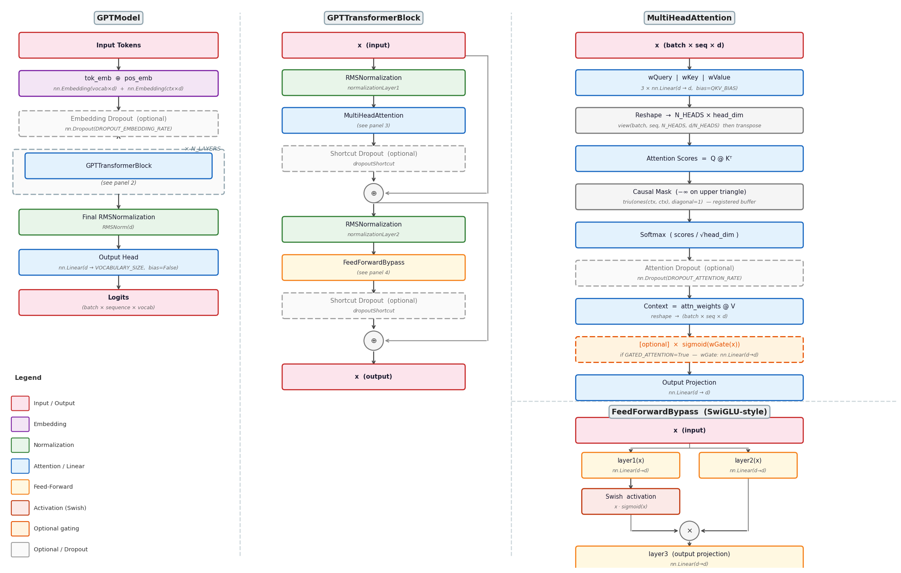

# momo-llm

A from-scratch GPT-style language model implementation in PyTorch, covering the full pipeline from raw text to trained model: tokenizer training, data preprocessing, model training, and text generation.

Supports multiple hardware backends (CUDA, MPS, CPU), configurable transformer architectures, SentencePiece and GPT-2 tokenizers, and optional synthetic data generation via Ollama.

---

## Table of Contents

- [Architecture](#architecture)
- [Model Structure](#model-structure)
- [Project Structure](#project-structure)
- [Configuration](#configuration)
- [Full Pipeline](#full-pipeline)
- [Commands](#commands)
  - [TrainModel.py](#trainmodelpy)
  - [RunModel.py](#runmodelpy)
  - [ChatModel.py](#chatmodelpy)
  - [PreProcessTokenizer.py](#preprocesstokenizerpy)
  - [PreProcessDataFiles.py](#preprocessdatafilespy)
  - [SplitTextDataFiles.py](#splittextdatafilespy)
  - [CheckModelConfig.py](#checkmodelconfigpy)
  - [OllamaGenerateTestData.py](#ollamageneratetestdatapy)
  - [OllamaGenerateTestDataFromFiles.py](#ollamageneratetestdatafromfilespy)
- [Dependencies](#dependencies)

---

## Architecture

Momo-LLM implements a decoder-only transformer (GPT-style) with the following components:

### Model (MomoModel.py)

The top-level `MomoModel` contains:

- **Token embeddings** — vocabulary-indexed embedding table
- **Stacked transformer blocks** (`MomoTransformerBlock`) — `N_LAYERS` deep
- **RMS normalization** — applied before the output head
- **Linear output head** — projects to vocabulary logits

Each `MomoTransformerBlock` contains:
- Multi-head self-attention with sandwich normalization (pre-norm + post-norm) and a skip connection
- SwiGLU feed-forward network with sandwich normalization (pre-norm + post-norm) and a skip connection
- Optional dropout at embedding, attention, and shortcut sites

### Attention (MomoModules.py)

`MultiHeadAttention` implements causal scaled dot-product attention with:

- Separate Q, K, V projections (optional bias)
- Optional gating on attention weights
- Optional KV cache for efficient autoregressive generation
- Causal mask to prevent attending to future tokens

### Normalization

- **RMSNormalization** — Root Mean Square normalization (LLaMA-style, no mean subtraction)
- **LayerNormalization** — standard layer norm (available as alternative)

### Feed-Forward

`FeedForwardBypass` implements a SwiGLU-style gated FFN:
- Two parallel linear projections, one gated by SiLU activation
- Element-wise product before the output projection

### Tokenizers (Tokenizers.py)

- **SentencePiece** — BPE tokenizer trained on your own data; model bytes can be embedded directly in the saved model file
- **GPT-2 (tiktoken)** — available as a fixed alternative for 50k-vocab configs

### Data Pipeline (Data.py, DataPreProcessing.py)

- Tokenized data stored as gzip-compressed pickle `.bin` files containing flat token ID lists
- `create_tokenized_dataloader_v1()` slices sequences into context-length chunks and wraps them in a PyTorch `DataLoader`
- Supports multiple file globs, configurable stride, and optional full-dataset device transfer

### Training (TrainModel.py)

- **Optimizer**: AdamW
- **Schedule**: linear warmup → cosine decay to `minimalLearningRate`
- **Gradient clipping**: max norm 1.0 (after warmup)
- **Mixed precision**: optional bfloat16 autocast (CUDA)
- **Compilation**: optional `torch.compile()`
- **Checkpointing**: saves `.pth` every N steps; saves final `.model` on completion
- **Evaluation**: reports train and validation loss at configurable step intervals

### Generation (GenerateText.py)

Token-by-token autoregressive decoding with:
- **Temperature** scaling
- **Top-K** sampling
- **Min-P** nucleus filtering
- Greedy decoding when `temperature=0`

---

## Model Structure



> Generate a fresh copy: `python3 utils/generate_architecture_diagram.py`

The model is built from a hierarchy of PyTorch modules defined in [`MomoModel.py`](MomoModel.py) and [`Modules.py`](Modules.py).

### MomoModel

The root module. Its `forward(inIndex, useCache)` pass runs:

```
token embeddings (nn.Embedding: VOCABULARY_SIZE × EMBEDDING_DIMENSION)
    ↓
[optional] embedding dropout
    ↓
MomoTransformerBlock × N_LAYERS
    ↓
RMSNormalization
    ↓
output head (nn.Linear: EMBEDDING_DIMENSION → VOCABULARY_SIZE, no bias)
    ↓
logits  (shape: batch × sequence × VOCABULARY_SIZE)
```

The `useCache` flag enables KV caching for fast autoregressive generation. `resetCache()` clears all cached keys/values and the position counter.

---

### MomoTransformerBlock

Each block applies two sub-layers with sandwich normalization (pre-norm and post-norm) around the core operation and a skip connection:

```
x ──────────────────────────────────────────────┐
│                                               │
normalizationLayer1  (pre-norm,  scale init: 1) │
    ↓                                           │
MultiHeadAttention                              │
    ↓                                           │
normalizationLayer2  (post-norm, scale init: 1/√layer)
    ↓                                           │
[optional] shortcut dropout                     │
    ↓                                           │
x = x + shortcut ◄─────────────────────────────┘

x ──────────────────────────────────────────────┐
│                                               │
normalizationLayer3  (pre-norm,  scale init: 1) │
    ↓                                           │
FeedForwardBypass                               │
    ↓                                           │
normalizationLayer4  (post-norm, scale init: 1/√layer)
    ↓                                           │
[optional] shortcut dropout                     │
    ↓                                           │
x = x + shortcut ◄─────────────────────────────┘
```

Each block holds four `RMSNormalization` instances and one optional `nn.Dropout` shared across both skip connections. The post-norm scale parameters are initialised to `1/√layer` (where `layer` is the 1-based block depth) to keep output magnitudes stable at initialisation across deep networks.

---

### MultiHeadAttention

Standard scaled dot-product multi-head attention with a causal mask. Head dimension is `EMBEDDING_DIMENSION // N_HEADS`.

```
x  (batch × seq × embed)
    ↓
wQuery, wKey, wValue   (nn.Linear: embed → embed, optional bias)
    ↓
reshape to (batch × seq × N_HEADS × head_dim), then transpose to
           (batch × N_HEADS × seq × head_dim)
    ↓
attention scores = Q @ Kᵀ
    ↓
causal mask  (upper-triangular −∞, registered as buffer)
    ↓
softmax(scores / √head_dim)
    ↓
[optional] attention dropout
    ↓
context = weights @ V
    ↓
reshape back to (batch × seq × embed)
    ↓
[optional] gated attention: context = context × sigmoid(wGate(x))
    ↓
outProjection  (nn.Linear: embed → embed)
```

**KV cache**: when `useCache=True`, keys and values from previous steps are concatenated and reused. The causal mask is applied only over the new query positions. `resetCache()` clears the buffers.

**Gated attention** (`GATED_ATTENTION=True`): a learned gate `wGate` (same shape as `wQuery`) modulates the context vectors element-wise via sigmoid before the output projection.

---

### FeedForwardBypass

A SwiGLU-style gated feed-forward network. All three projections map `EMBEDDING_DIMENSION → EMBEDDING_DIMENSION` (no expansion factor):

```
x
├── layer1(x) → apply Swish activation
└── layer2(x) ──────────────────────┐
                                    │
         Swish(layer1(x)) × layer2(x)
                    ↓
              layer3(...)
```

`Swish(x) = x × sigmoid(x)` is implemented as the `Swich` module in `Modules.py`.

---

### Normalization Modules

| Module | Formula | Trainable params | Used in |
|---|---|---|---|
| `RMSNormalization` | `x / RMS(x) × scale` | `scale` (shape: embed) | All norm layers in the active model |
| `LayerNormalization` | `(x − mean) / std × scale + shift` | `scale`, `shift` (shape: embed) | Available but not used by default |

Both use ε = 1e-5 for numerical stability. `RMSNormalization` skips mean subtraction, matching the LLaMA normalization style.

`RMSNormalization` takes an optional `layer` argument that controls the initial value of `scale`:

| `layer` argument | Scale init | Used for |
|---|---|---|
| `None` | `1.0` | Pre-norm layers (`normalizationLayer1`, `normalizationLayer3`), final norm |
| `int` (block depth) | `1 / √layer` | Post-norm layers (`normalizationLayer2`, `normalizationLayer4`) |

Initialising post-norm scales to `1/√layer` keeps the residual contribution of deeper blocks small at the start of training, stabilising gradient flow in deep networks.

---

### Activation Functions

| Module | Formula | Used in |
|---|---|---|
| `Swich` | `x × sigmoid(x)` (Swish / SiLU) | `FeedForwardBypass` gate |
| `GELU` | `0.5x(1 + tanh(√(2/π)(x + 0.044715x³)))` | `FeedForward` (legacy, not used by default) |

---

## Project Structure

```
momo-llm/
├── MomoModel.py                         # Transformer model and block definitions
├── MomoModelConfig.py                   # Pre-defined architecture configs
├── Modules.py                          # Attention, normalization, FFN modules
├── Tokenizers.py                       # SentencePiece and GPT-2 tokenizer wrappers
├── Data.py                             # DataLoader creation and file discovery
├── DataPreProcessing.py                # Text normalization and replacement rules
├── GenerateText.py                     # Autoregressive text generation
├── MomoModelStorage.py                  # Model save/load utilities
│
├── TrainModel.py                       # CLI: train a model
├── RunModel.py                         # CLI: generate text from a trained model
├── ChatModel.py                        # CLI: interactive multi-turn chat
├── PreProcessTokenizer.py              # CLI: train a SentencePiece tokenizer
├── PreProcessDataFiles.py              # CLI: tokenize raw text into .bin files
├── SplitTextDataFiles.py               # CLI: split large text files
├── CheckModelConfig.py                 # CLI: inspect a config's parameter count
├── OllamaGenerateTestData.py           # CLI: generate synthetic data via Ollama
├── OllamaGenerateTestDataFromFiles.py  # CLI: template-based Ollama generation
│
├── input-data/                         # Raw text training data
├── processed-data/                     # Tokenized .bin datasets
├── models/                             # Trained model checkpoints and .model files
├── vocabulary/                         # SentencePiece .model and .vocab files
├── utils/                              # Helper scripts
└── requirements.txt
```

### File Conventions

| Artifact | Path |
|---|---|
| Trained model | `models/{name}/{name}.model` |
| Training checkpoint | `models/{name}/{name}.pth` |
| Vocabulary | `vocabulary/{name}-{size}/{name}-{size}.model` |
| Tokenized data | `processed-data/{name}/{name}-000.bin` |

---

## Configuration

Model architectures are defined as named configs in [`MomoModelConfig.py`](MomoModelConfig.py). Each config specifies:

| Field | Description |
|---|---|
| `CONFIG_NAME` | Unique string identifier |
| `VOCABULARY_SIZE` | Number of tokens in the vocabulary |
| `CONTEXT_LENGTH` | Maximum sequence length |
| `EMBEDDING_DIMENSION` | Hidden dimension size |
| `N_HEADS` | Number of attention heads |
| `N_LAYERS` | Number of transformer blocks |
| `DROPOUT_EMBEDDING_RATE` | Embedding dropout probability |
| `DROPOUT_ATTENTION_RATE` | Attention dropout probability |
| `DROPOUT_SHORTCUT_RATE` | Skip-connection dropout probability |
| `QKV_BIAS` | Whether to use bias in Q/K/V projections |
| `GATED_ATTENTION` | Whether to apply gating to attention weights |
| `DEFAULT_DATA_TYPE` | `torch.bfloat16`, `torch.float32`, etc. |
| `TOKENIZER_TYPE` | `"sentencepiece"` or `"gpt2"` |
| `TOKENIZER_NAME` | Tokenizer model name to load |

To add a new config, define a dict in `MomoModelConfig.py` and register it in the `modelConfigs` list:

```python
MY_CONFIG = {
    CONFIG_NAME: "MY_CONFIG",
    VOCABULARY_SIZE: 12000,
    CONTEXT_LENGTH: 400,
    EMBEDDING_DIMENSION: 460,
    N_HEADS: 20,
    N_LAYERS: 16,
    DROPOUT_EMBEDDING_RATE: 0.0,
    DROPOUT_ATTENTION_RATE: 0.0,
    DROPOUT_SHORTCUT_RATE: 0.0,
    QKV_BIAS: False,
    GATED_ATTENTION: False,
    DEFAULT_DATA_TYPE: torch.bfloat16,
    TOKENIZER_TYPE: "sentencepiece",
    TOKENIZER_NAME: "my-vocab-12000"
}
```

Use `CheckModelConfig.py` to inspect parameter count and memory size for any config before training.

---

## Full Pipeline

```bash
# 1. (Optional) Generate synthetic training data with Ollama
python3 OllamaGenerateTestData.py \
  --model="llama3.2:3b" \
  --system="you are a conversation generator" \
  --prompt="generate a casual conversation between 300 and 2000 words" \
  --numberOfGenerations=10000 \
  --outputFileName="conversations" \
  --outputFileFolder="./input-data/conversations"

# 2. Train a SentencePiece tokenizer on your raw data
python3 PreProcessTokenizer.py \
  --inputData="./input-data/**" \
  --vocabSize=12000 \
  --vocabularyName="my-vocab" \
  --forceLowerCase \
  --newTrainingFile

# 3. Tokenize the raw data into .bin files
python3 PreProcessDataFiles.py \
  --inputData="./input-data/**" \
  --vocabulary="my-vocab-12000" \
  --tokenizer="sentencepiece" \
  --outputFileName="my-dataset" \
  --isTokenized \
  --forceLowerCase \
  --newOutputFile

# 4. Train the model
python3 TrainModel.py \
  --model="my-llm" \
  --config="CONV_ENG_LC_12K_CONFIG_XS_400_16L_20H_460E" \
  --inputData="processed-data/my-dataset/**.bin" \
  --numberOfEpochs=4 \
  --batchSize=40 \
  --device="mps" \
  --newModel

# 5. Generate text
python3 RunModel.py \
  --model="my-llm" \
  --prompt="Hello, how are you" \
  --tokensToGenerate=200

# 6. Or start an interactive chat session
python3 ChatModel.py --model="my-llm"
```

To continue training from a checkpoint, run step 4 again without `--newModel`.

---

## Commands

### TrainModel.py

Train a model from tokenized `.bin` files.

```bash
python3 TrainModel.py [options]
```

| Argument | Default | Description |
|---|---|---|
| `--model` | required | Model name; saved to `models/{name}/` |
| `--config` | required | Config name from `MomoModelConfig.py` |
| `--inputData` | required | Glob pattern for `.bin` data files |
| `--batchSize` | `40` | Training batch size |
| `--numberOfEpochs` | — | Number of full passes over the dataset |
| `--peakLearningRate` | `0.001` | Learning rate at end of warmup |
| `--minimalLearningRate` | `0.004` | Minimum LR after cosine decay |
| `--warmupSteps` | — | Number of linear warmup steps |
| `--trainRatio` | `0.9` | Fraction of data used for training |
| `--evaluationStepFrequency` | — | Steps between loss evaluations |
| `--checkpointStepStorageFrequency` | — | Steps between checkpoint saves |
| `--startContext` | — | Sample prompt printed during evaluation |
| `--device` | auto | `cuda`, `mps`, or `cpu` |
| `--compileModel` | `False` | Enable `torch.compile()` |
| `--useAutocast` | `False` | Enable bfloat16 autocast (CUDA only) |
| `--moveDatasetToDevice` | `False` | Load full dataset onto GPU/MPS memory |
| `--shuffleInputFiles` | `False` | Randomize file order before training |
| `--shuffleBatches` | `False` | Shuffle batches within the DataLoader |
| `--newModel` | `False` | Create a new model; omit to resume from checkpoint |

---

### RunModel.py

Generate text from a trained model.

```bash
python3 RunModel.py [options]
```

| Argument | Default | Description |
|---|---|---|
| `--model` | required | Model name (must exist in `models/{name}/`) |
| `--prompt` | required | Starting text prompt |
| `--tokensToGenerate` | `100` | Number of tokens to generate |
| `--temperature` | `0.5` | Sampling temperature (`0` = greedy) |
| `--topK` | `-1` | Top-K candidates (`-1` = disabled) |
| `--minP` | `0.1` | Min-P nucleus threshold |
| `--forceLowerCase` | `False` | Lowercase the input prompt |
| `--printNextToken` | `False` | Print each token as it is generated |
| `--device` | auto | `cuda`, `mps`, or `cpu` |
| `--compileModel` | `False` | Enable `torch.compile()` |

---

### ChatModel.py

Interactive multi-turn chat with a trained model. Type your message at the prompt and press Enter; the conversation accumulates context across turns.

```bash
python3 ChatModel.py [options]
```

| Argument | Default | Description |
|---|---|---|
| `--model` | required | Model name |
| `--tokensToGenerate` | `100` | Max tokens per response |
| `--temperature` | `0.5` | Sampling temperature |
| `--topK` | `-1` | Top-K candidates (`-1` = disabled) |
| `--minP` | `0.1` | Min-P nucleus threshold |
| `--autoAppendPeriod` | `False` | Append a period if the prompt has none |
| `--forceLowerCase` | `False` | Lowercase all input |
| `--ommitEos` | `False` | Do not append end-of-sequence token |
| `--device` | auto | `cuda`, `mps`, or `cpu` |

---

### PreProcessTokenizer.py

Train a SentencePiece BPE tokenizer on raw text files.

```bash
python3 PreProcessTokenizer.py [options]
```

| Argument | Default | Description |
|---|---|---|
| `--inputData` | required | Glob pattern for raw text files |
| `--vocabSize` | `4096` | Vocabulary size |
| `--vocabularyName` | required | Output tokenizer name |
| `--outputDirectory` | `./vocabulary` | Save location |
| `--globPattern` | `**/**` | Sub-glob within `inputData` |
| `--forceLowerCase` | `False` | Lowercase training data |
| `--newTrainingFile` | `False` | Overwrite existing training corpus |

Output: `vocabulary/{name}-{size}/{name}-{size}.model` and `.vocab`.

---

### PreProcessDataFiles.py

Tokenize raw text files into compressed `.bin` datasets for training.

```bash
python3 PreProcessDataFiles.py [options]
```

| Argument | Default | Description |
|---|---|---|
| `--inputData` | required | Glob pattern for raw text files (separate multiple patterns with `\|`) |
| `--vocabulary` | required | Tokenizer name (e.g. `my-vocab-12000`) |
| `--tokenizer` | `sentencepiece` | `"sentencepiece"` or `"gpt2"` |
| `--outputFileName` | required | Output file prefix |
| `--outputDirectory` | `./processed-data` | Save location |
| `--outputBatchSizeMb` | `500` | Max size per output file in MB |
| `--isTokenized` | `True` | Write binary token IDs; `False` writes plain text |
| `--forceLowerCase` | `False` | Lowercase during tokenization |
| `--newOutputFile` | `False` | Create new output; omit to append to existing |

Output: `processed-data/{name}/{name}-000.bin`, `001.bin`, … (gzip-compressed pickle files).

---

### SplitTextDataFiles.py

Split large raw text files into smaller chunks before tokenization.

```bash
python3 SplitTextDataFiles.py [options]
```

| Argument | Default | Description |
|---|---|---|
| `--inputData` | required | Glob pattern for input text files |
| `--outputFileName` | required | Output file prefix |
| `--outputDirectory` | — | Save location |
| `--outputBatchSizeMb` | `500` | Target chunk size in MB |

---

### CheckModelConfig.py

Print the parameter count and estimated memory size for a named config.

```bash
python3 CheckModelConfig.py --config="GPT_CONFIG_SMALL"
```

Useful for estimating GPU memory requirements before committing to a training run.

---

### OllamaGenerateTestData.py

Generate synthetic training data by calling a locally running Ollama model in a loop. Requires `ollama serve` to be running.

```bash
python3 OllamaGenerateTestData.py [options]
```

| Argument | Default | Description |
|---|---|---|
| `--model` | required | Ollama model tag (e.g. `llama3.2:3b`) |
| `--system` | — | System prompt sent to Ollama |
| `--prompt` | required | Generation prompt |
| `--numberOfGenerations` | — | Number of generation calls |
| `--generationSizeMb` | — | Stop after accumulating this many MB |
| `--outputFileName` | required | Output file prefix |
| `--outputFileFolder` | `./input-data` | Save location |
| `--fileSplitSizeMb` | `50` | Split output files at this size in MB |
| `--replacementFilePath` | — | Path to a `.rep` text replacement rules file |
| `--printInterval` | — | Print status every N generations |
| `--newTrainingFile` | `False` | Overwrite existing output |

---

### OllamaGenerateTestDataFromFiles.py

Generate synthetic data using file contents as context, with placeholder markers in the prompt template.

```bash
python3 OllamaGenerateTestDataFromFiles.py [options]
```

| Argument | Default | Description |
|---|---|---|
| `--model` | required | Ollama model tag |
| `--inputData` | required | Glob pattern for source/template files |
| `--prompt` | required | Prompt template; use `{{content}}` and `{{subject}}` as placeholders |
| `--numberOfGenerations` | — | Total generation calls |
| `--outputFileName` | required | Output file prefix |
| `--startFromFileIndex` | `0` | Skip the first N input files |
| `--newTrainingFile` | `False` | Overwrite existing output |

---

## Dependencies

Install dependencies with:

```bash
pip install -r requirements.txt
```

| Package | Purpose |
|---|---|
| `torch` | Core deep learning framework |
| `sentencepiece` | BPE tokenizer training and inference |
| `tiktoken` | GPT-2 tokenizer (via OpenAI's library) |
| `numpy` | Numerical utilities |
| `matplotlib` | Loss curve plotting |
| `ollama` | Client for local Ollama model inference |
